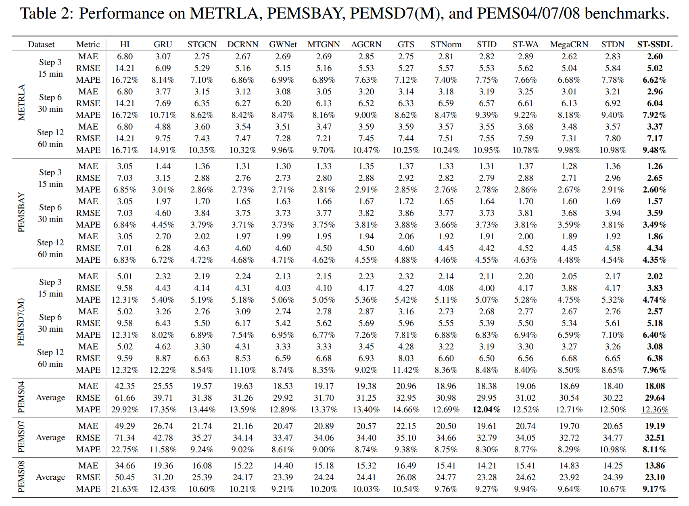

# ST-SSDL
An implementation of ST-SSDL under GCRU backbone.


* Run following commands to prepare data:

  ```bash
  python generate_training_data_his_BAY.py
  python generate_training_data_his_LA.py
  python generate_training_data_his_PEMS.py --dataset PEMS04
  python generate_training_data_his_PEMS.py --dataset PEMS07
  python generate_training_data_his_PEMS.py --dataset PEMS08
  python generate_training_data_his_D7.py --dataset PEMSD7M
  ```

* Then train the model with following commands:

  ```bash
  cd model_STSSDL
  python train_STSSDL.py --gpu 1 --dataset METRLA
  python train_STSSDL.py --gpu 1 --dataset PEMSBAY
  python train_STSSDL.py --gpu 1 --dataset PEMSD7M
  python train_STSSDL.py --gpu 1 --dataset PEMS04
  python train_STSSDL.py --gpu 1 --dataset PEMS07
  python train_STSSDL.py --gpu 1 --dataset PEMS08
  
  ```

  ##  Performance on Spatiotemporal Forecasting Benchmarks

